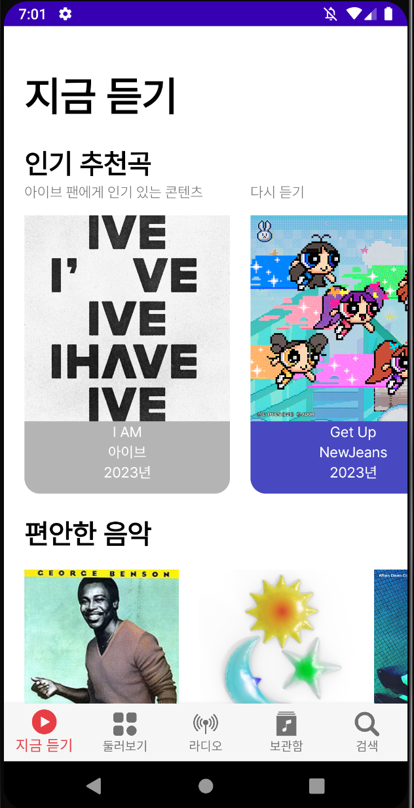
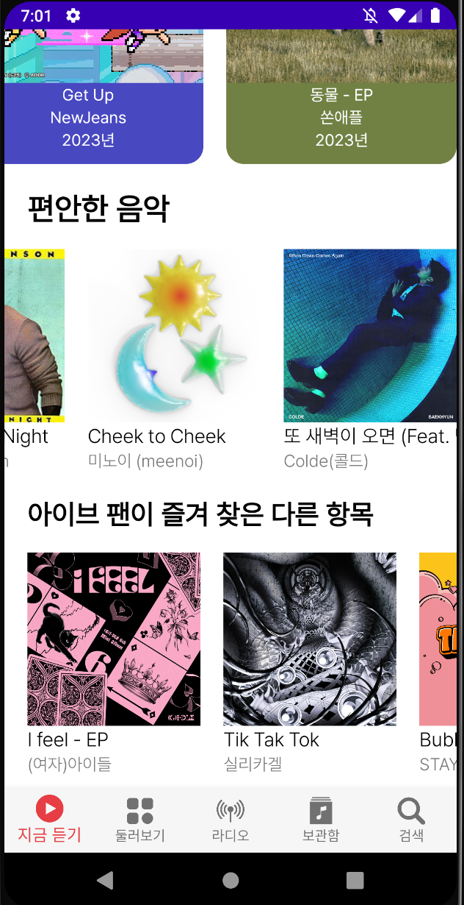
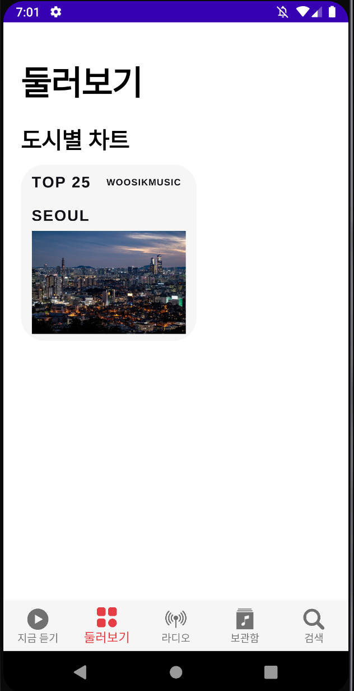
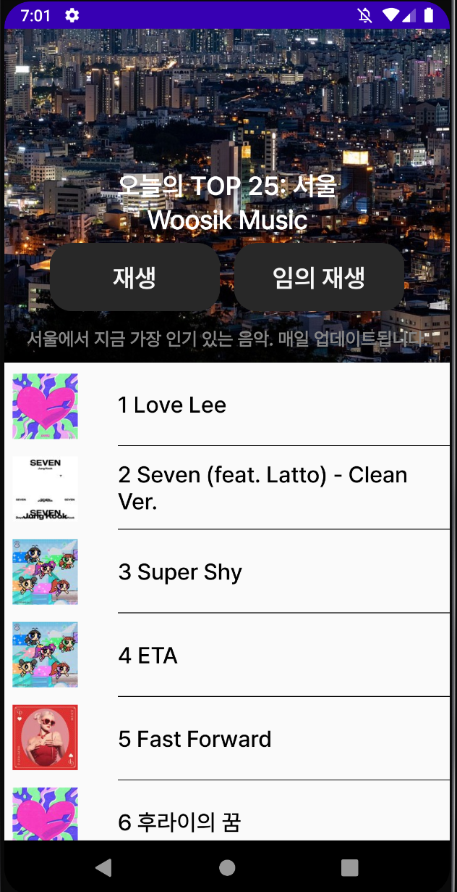
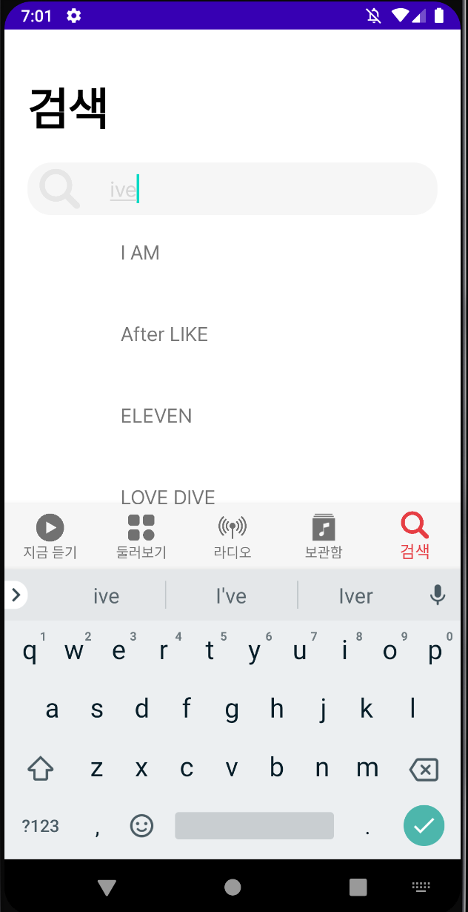
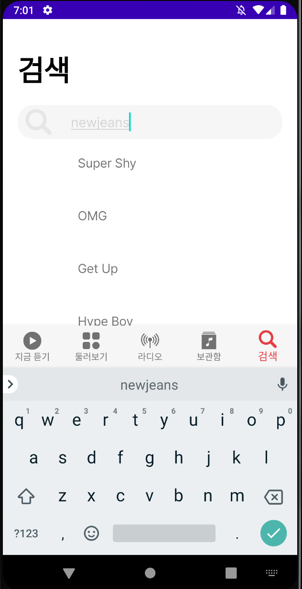

# applemusic_clone
포트폴리오용 애플 뮤직 안드로이드에서 클론코딩하기 (9/4일~)

<h2>지금 듣기</h2>
<h4>시간 상 추천 알고리즘 구현 부재로 샘플이미지로 인터페이스 구현하였습니다</h4>
<table>
  <tr>
    <td></td><td></td>
  <tr>
</table>
<h2>둘러보기</h2>
<h4>애플뮤직의 top25를 Jsoup로 멜론차트를 크롤링하여 구현하였습니다</h4>
<table>
  <tr>
    <td></td><td></td>
  <tr>
</table>
<h2>검색</h2>
<h4>아이튠즈 api를 이용하여 검색 기능을 구현하였습니다</h4>
<h5>https://developer.apple.com/library/archive/documentation/AudioVideo/Conceptual/iTuneSearchAPI/index.html</h5>
<table>
  <tr>
    <td></td><td></td>
  <tr>
</table>

<h2>앞으로 개선해야할 점</h2>
<h4>뷰 수정이 메인쓰레드에서만 가능하여 검색 기능에서 이미지를 불러오지 못한 점</h4>
<h4>시간 상 구현하지 못한 음악 재생</h4>
<h4>개발자 토큰 부재로 100px 이상의 이미지 불러오기 불가능</h4>
<h4>조잡한 코드</h4>

<h2>사용한 폰트</h2>
<h4>Pretendard</h4>

<h1>부족한 포트폴리오 봐주셔서 감사합니다!</h1>
